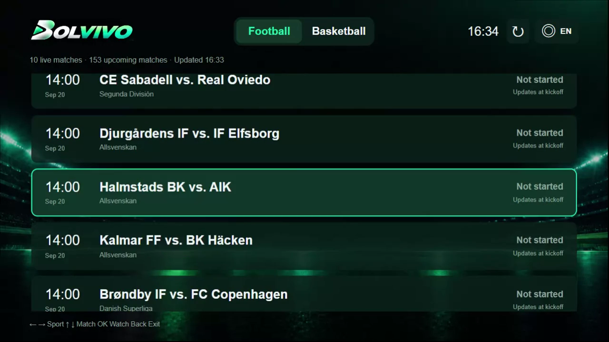
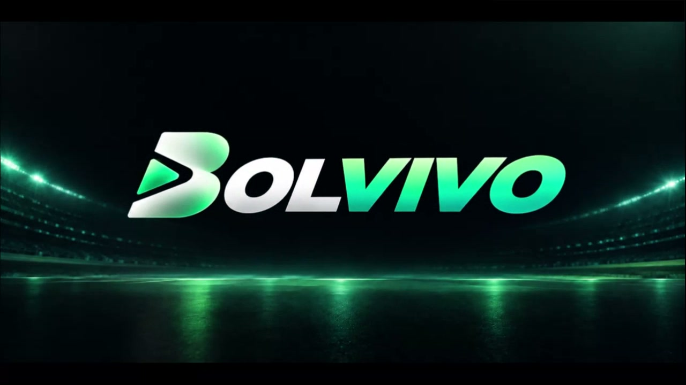
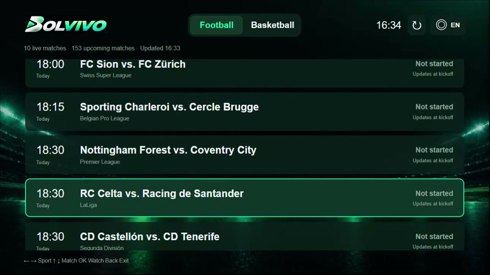
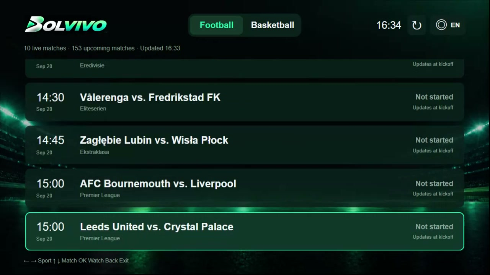

# Bolvivo for Android TV

## Watch the one-minute demo

https://github.com/user-attachments/assets/52463c58-8292-4be8-897f-43a28476de48

**English TV walkthrough:** 69 seconds, 720p. Press play above to watch it directly on GitHub.

The recording shows the real TV interface, remote navigation, match selection, connection attempts, and playback behavior. Fixtures and stream availability naturally change over time.



**A free, non-commercial Android TV beta built by an independent developer and sports fan.**

Hi! I built Bolvivo because I wanted a simpler way to browse football and basketball fixtures on a TV, choose a match with a remote, and move straight into full-screen playback.

This is a personal side project. There is no company, subscription, paid tier, or in-app advertising behind it. I am sharing the beta for free and would genuinely appreciate help finding bugs and learning which Android TV / Google TV devices work well.

## Closed beta: first 50 testers

The first beta is limited to **50 activated devices** so I can review feedback and keep the service manageable.

1. Download **[Bolvivo TV 1.5.20 beta](https://api.bolvivo.com/downloads/Bolvivo-TV-1.5.20-beta50.apk)**.
2. Install the APK on an Android TV or Google TV device.
3. Open Bolvivo and enter the access code below.

### Access code: `0741`

The code will stop accepting new devices after all 50 places have been claimed. An activated installation keeps its place.

APK SHA-256:

```text
8d0d28765562be2731d4c9dbb9fd25f81c801a047ed35bd90761e3d9b860d33c
```

## Screenshots

### Bolvivo launch screen



### Browse football fixtures on a TV



### Navigate and select a match with the remote



## What it does

- Built specifically for Android TV and Google TV remotes
- Football and basketball fixture lists
- Live and upcoming matches organized in a TV-friendly interface
- One-click full-screen playback
- Automatic fallback when a selected source cannot start or stops working
- Manual time-zone selection for accurate kickoff times
- Interface support for English, Spanish, French, German, Chinese, Portuguese, Italian, Arabic, Japanese, and Korean
- No account registration, subscription, or in-app advertising

## What I would love you to test

Please open a **[GitHub Issue](../../issues)** and tell me:

- Your TV or streaming-device model
- Android TV / Google TV version
- Whether installation and activation worked
- Whether remote navigation felt natural
- Whether a match started, buffered, failed, or needed fallback
- Your country or region, if you are comfortable sharing it
- Steps that reproduce any bug

Please do **not** post private information, device identifiers, stream addresses, or copyrighted video in an issue.

## Installation notes

Bolvivo is distributed as a signed APK, not through Google Play. Android may ask you to allow installation from your file manager or downloader. Only download the APK from this repository or the official Bolvivo download service, and verify the SHA-256 value above if possible.

This beta targets television devices. Phones, tablets, Fire TV, unusual Android forks, and older hardware may behave differently and are not currently guaranteed.

## Privacy summary

The beta does not require a personal account. To operate the 50-device test and diagnose reliability, it uses a random anonymous installation identifier and may record app/device version, language, approximate region derived from the network IP, playback outcome, error/fallback events, and viewing duration.

It does not request contacts, phone number, precise GPS location, SMS, or advertising identifiers. Please uninstall the app if you do not want to participate in this testing telemetry.

## Content and service boundary

Bolvivo does not host, store, record, cache, or relay video. The app presents event information and asks its service for a currently available playback option; the TV then connects directly to that third-party source. Availability, quality, rights, and regional access can vary, and a listed event is not a guarantee of playback.

Rights to third-party events, broadcasts, team names, league names, and related marks belong to their respective owners. Bolvivo is not affiliated with or endorsed by any league, club, broadcaster, or streaming provider. Use the app only for personal, non-commercial testing and follow the laws and service rules that apply where you live.

## Source code

This is a **product-information and beta-distribution repository**. The application and server source code are proprietary and are not included or licensed as open source.

You are welcome to download and test the official APK, report bugs, and suggest improvements. Please do not sell, repackage, impersonate, or redistribute modified builds as Bolvivo.

---

Thanks for helping a small independent project get better.
